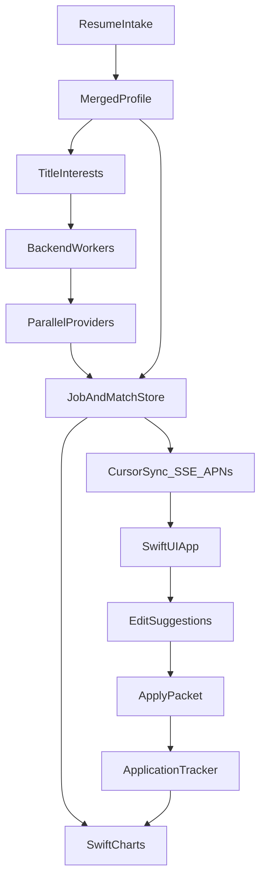
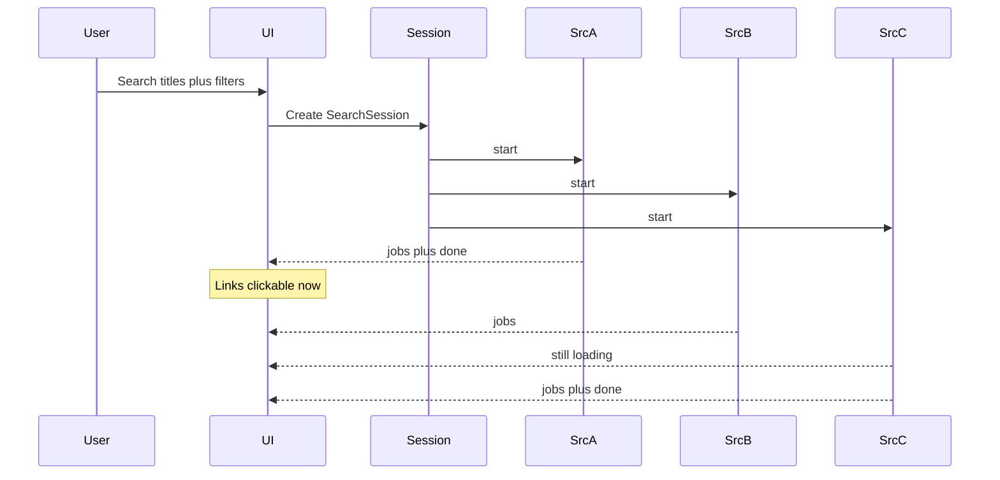
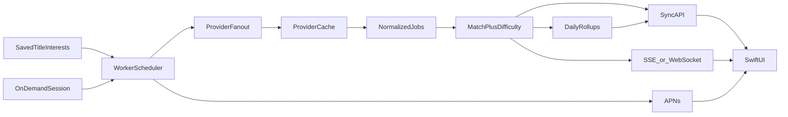
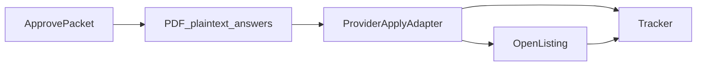
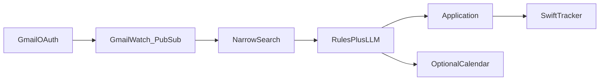

# Job Hunt OS — Product Plan

A daily job-hunt tool: ingest a rich background from one or more resumes, suggest roles and titles, run source searches **on a backend**, deliver results to a **SwiftUI client**, fully read each JD for hidden requirements, match like LinkedIn, chart the hunt, suggest resume edits, then apply after you approve the packet.

This repo is greenfield. This file is the implementation contract.

## Product defaults

| Decision | Choice |
|---|---|
| Audience | Personal first; one backend, SwiftUI app (Mac + iPhone) as the client |
| Client | SwiftUI + Swift Charts + SwiftData local cache |
| Backend | TypeScript (or Python) API + worker: intake, providers, match, rollups |
| Search | Parallel providers **on the server**; standing queries on a schedule; on-demand sessions stream to the app |
| Delivery | Durable job store + cursor sync; SSE/WebSocket for a live hunt; optional APNs when new matches land |
| Matching | Deterministic profile + JD graph, same shape as LinkedIn “Jobs you might be a fit for” |
| Difficulty | Every match is banded **easy / medium / reach** for charts and inbox filters |
| Tailoring | Suggested edits from the merged inventory; you accept, reject, or rewrite |
| Apply | Approve-then-send: official listing URL always; ATS / partner apply where the adapter can submit |
| Mail | User-authorized **Gmail OAuth** on our backend; classify threads into applied / rejection / interview / screen / offer. OpenAI classifies mail we already fetched — it does **not** inherit ChatGPT’s Gmail connection |

Years/seniority caps, source toggles, and template style are **user preferences**, not product locks. Filters default on and can be turned off per search.

## Product loop



Daily use:

1. First run: upload one or more resumes (and optional LinkedIn export / plain text). The app builds a merged background and **suggests job titles**.
2. You add/remove titles, locations, and which sources to hit.
3. The **backend** starts (or continues) source pulls. The Swift app shows a live spinner + still-pulling dropdown; each row is a clickable listing as soon as that source returns.
4. Home charts update from the same store: applications, new matches, easy / medium / reach.
5. Open a job: full JD, hidden-requirement callouts, LinkedIn-style fit breakdown, suggested resume edits.
6. Accept/reject/edit suggestions, export, approve, apply, log it. The tracker and graphs stay in sync.

## Resume intake (rich background)

Intake is the foundation. More resumes = a fuller graph of what you have actually done, which makes title suggestions and JD matching deterministic instead of guessy.

### Inputs

- Multiple files: PDF, DOCX, TXT
- Optional paste (LinkedIn About + Experience, or a JD you already tailored toward)
- Later: CSV / JSON export if you keep a master inventory

Each upload is stored as a **ResumeDocument** (raw text + parse tree). Nothing is discarded; a skill that only appears on an older consulting CV still counts for matching.

### What we extract

Parser (layout-aware text extract → section split → structured LLM pass with a strict schema):

| Field | Examples |
|---|---|
| Identity | name, emails, phones, links, locations, work-auth hints |
| Titles held | exact headings + normalized title (`Staff PM` → `product manager`, seniority `staff`) |
| Employment | company, team, dates, employment type, industry, domain |
| Fact bullets | action, object, tools, metrics, outcomes — kept as atomic facts |
| Skills | explicit lists + tools mentioned only in bullets |
| Education / certs | school, degree, license, cert, date |
| Projects / pubs | names, stack, links |
| Preferences inferred | remote vs onsite, industries repeated, leadership vs IC |

### Merge

`MergedProfile` is a union with provenance:

- Same company+title+overlapping dates → one `ExperienceItem`, bullets de-duped
- Conflicting dates or titles → both kept, flagged for you to resolve
- Skills get aliases (`k8s` → `Kubernetes`) and a **confidence** (listed vs only-in-bullet vs only-on-one-resume)
- A fact is never dropped because a newer resume omitted it

### Deterministic role suggestions

From the merged graph, before any LLM “career coach” copy:

1. **Exact titles** you have held
2. **Title taxonomy walk** — adjacent roles (ONET / SOC / a maintained title graph). Example: technical writer → documentation engineer, content designer, developer advocate
3. **Skill-signature titles** — titles whose typical skill vector overlaps yours above a threshold (the LinkedIn “jobs matching your profile” idea)
4. **Industry + function** — e.g. fintech + operations → payments operations, implementation manager
5. **Seniority band** from dates + title words, so we do not only suggest Staff when your history is mid-level

The UI shows each suggestion with **why** (“held adjacent title”, “12 shared skills with typical PM JDs”, “domain: healthcare”). You pin titles into **TitleInterests**. Those, plus any titles you type yourself, drive search.

### User-entered titles

Free-type, multi-value, with autocomplete from the taxonomy. Titles are first-class search queries, not hidden inside a single “lens” box. Lenses become optional groupings (e.g. “writing track” vs “ops track”) over the same title list.

## Job sources (wide catalog)

Every source is a `JobProvider`: `startSearch(query) → AsyncIterable<NormalizedJob | SourceEvent>`.

Providers run **in parallel**. A source that is slow or down does not block others. New providers are additive.

### Aggregators and boards (listings + original URLs)

| Provider | What it covers |
|---|---|
| **JSearch / Google-for-Jobs style APIs** | Indeed, LinkedIn, Glassdoor, ZipRecruiter, and other hosts as they appear in Google Jobs |
| **SerpApi Google Jobs** | Same surface; useful second crawler if JSearch misses a query |
| **JobsPipe / Hirebase / Jobo** (whichever keys we have) | Normalized ATS + board feed, webhooks for new posts |
| **Adzuna** | Country-wide board search |
| **Jooble** | International aggregator |
| **The Muse** | Company-profile-rich posts |
| **USAJobs + CareerOneStop** | US federal / public sector |
| **Remote-first boards** | Remote OK, We Work Remotely, Remotive, Himalayas, Jobicy, Working Nomads |
| **Startup / tech boards** | Wellfound, Otta / Welcome to the Jungle, YC Work at a Startup, HN Who’s Hiring parse when a public feed exists |
| **Specialty** | Dice, Built In, HealthcareJobs, Idealist, Chronicle Vitae — enable per user |
| **RSS / ATOM** | Any board or company feed the user pastes |
| **URL / paste** | Single JD import |

### Company ATS boards (full descriptions, stable apply URLs)

Greenhouse, Lever, Ashby, Workday, SmartRecruiters, Workable, Recruitee, Personio, BambooHR, Teamtailor, Rippling, Jobvite, Comeet, Pinpoint, Polymer — public job-board JSON/XML where it exists.

Seed a large **company slug directory**; users add slugs. These often have the **complete JD** that Google-for-Jobs truncates — required for hidden-requirement reading.

### Source settings

Per search (and saved defaults): enable/disable each provider, country, recency, remote, salary floor. No source is banned at the product layer. If a provider needs an API key, it shows “Connect” and stays in the still-loading dropdown as `needs_key` until configured.

### Dedup

As results stream in: `(normalized company + title + location)` and apply-URL fingerprint. Duplicates merge onto one card with **multiple source links** (Indeed listing + Greenhouse board + LinkedIn post). The first clickable link is shown immediately; extra sources attach when they arrive.

## Progressive search UX

This is the hunt screen.



### Layout

- **Results list** fills from the first payload. Each row: title (link to original listing), company, location, source badge, fit score if enrichment has finished, “still reading JD…” if not.
- **Source bar**
  - Completed: `Adzuna 24` `Greenhouse 18` — click filters the list to that source
  - In flight: spinner + **dropdown** “Still pulling (3): Indeed, LinkedIn, Glassdoor”
  - Failed: `Dice failed — retry`
  - Waiting on keys: `JobsPipe — add API key`
- Clicking a completed source chip does not wait for the others.
- A job is **clickable the moment we have a URL**, even if the deep JD read is still running. Enrichment patches the row in place (hidden-req badges, fit %).

### Transport

`SearchSession` + `SearchSourceRun` rows. The UI subscribes via **SSE** (`/api/search/[id]/events`): `source_started`, `job`, `source_done`, `source_error`, `enrichment`, `session_done`. Polling fallback for environments that buffer SSE.

Each `job` event includes `listingUrl` so the client can render a tappable link immediately.

## Backend search and sustainable delivery

Yes: source searches run on the backend and are **delivered** to the Swift app. The phone/Mac never holds provider keys and never has to stay awake for a 12-source pull.



### Two ways a search starts

1. **Standing queries** — saved title interests + locations + enabled sources. A worker runs them on a schedule (default every 4–6 hours, user-tunable). This is how “new jobs that match you” stay fresh without opening the app.
2. **On-demand session** — you tap Search (new title, new city). Same providers, streamed live to the open app via SSE/WebSocket. Results are still persisted, so killing the app does not lose them.

### What “sustainable” means

| Pressure | How we keep it cheap and stable |
|---|---|
| Provider rate limits | Cache listings by `(provider, native_id)` and query fingerprints for 24–48h. Do not re-hit Indeed-via-JSearch for the same title+city every app open. |
| LLM cost | Deterministic match on ingest. Deep-read / vision / edit-suggest only for **new unique JD hashes** and for jobs you open. |
| Duplicate posts | Dedupe on the server. One `Job`, many source links. Charts count jobs, not cross-posts. |
| Payload size | App syncs a **cursor**: `GET /sync?since=`. Only new/changed jobs, matches, applications, rollups. Full snapshot on first install. |
| Phone sleep | Workers finish on the server. If the app is backgrounded mid-session, it picks up via sync. Optional silent APNs: “14 new matches (6 easy).” |
| Failed sources | `SearchSourceRun` stays `error` / `retry`. One dead board does not fail the session. |
| Cost spikes | Per-user daily caps on on-demand refreshes; standing queries share the cache across titles when the provider result sets overlap. |

The backend is the system of record (`Job`, `Match`, `Application`, `DailyRollup`). SwiftData is a cache so graphs and the inbox work offline.

### Delivery APIs

- `POST /search/sessions` — on-demand; subscribe `GET /search/sessions/:id/events`
- `GET /sync?since=` — inbox + tracker + rollups
- `GET /stats/jobs?from=&to=` — time series for charts (new matches by day, by difficulty, by source)
- `GET /stats/applications?from=&to=` — applied / interview / closed
- `PATCH /applications/:id` — tracker updates from the app
- Push: APNs when standing-query ingest adds matches above a threshold

Personal deploy: one small always-on box (Fly / Railway / a Mac mini). Keys live only there.

## Deep JD read (hidden requirements)

When a listing arrives, a worker fetches the **full description** (aggregator snippet is not enough; prefer ATS `content` / hosted page text via the provider’s documented API or the listing’s public HTML when the provider returns it).

`JDDeepRead` produces:

| Bucket | What we look for |
|---|---|
| **Stated** | Years, degree, skills, location, employment type, salary |
| **Hidden / implied** | Years only in a responsibility line; “fast-paced ownership” = low support; “mentor the team” = lead; “US persons” / clearance; “remote” that is metro-only; travel %; on-call; lifting/physical; language; unpaid overtime culture tells; visa silence + “must be local” |
| **Nice-to-have vs real gate** | Phrases in Requirements vs Responsibilities vs “plus” |
| **Level signals** | Scope (org vs ticket), IC vs manager, Staff language without the title |
| **Domain** | Industry, customer type, regulated environment |
| **Stack** | Tools mentioned once in a duty — still a match signal |

Years/seniority is one slice of this, not the whole filter. User prefs: hide if min years > N, or only **badge** it. Override per job.

## LinkedIn-style matching

LinkedIn ranks jobs from a member graph: titles, skills, seniority, recency, location, and implicit “people like you.” We do the same against `MergedProfile` + `JDDeepRead`.

`matchScore(profile, job)` returns a breakdown, not a single mystery number:

- **Title affinity** — interest titles + held titles vs posting title (taxonomy + string + embedding)
- **Skill overlap** — required / implied / nice-to-have vs possessed (with aliasing)
- **Hidden-req fit** — visa, clearance, degree, onsite, travel, years: pass / soft-miss / hard-miss
- **Seniority alignment** — your band vs posting band
- **Domain / industry**
- **Recency** — relevant facts in the last N years weighted higher
- **Geo / remote**
- **Resume coverage** — could we surface enough inventory to make a credible tailored resume?

Sort inbox by this score. Explain each job in one line: “Strong skill match; hidden 7+ years (you have 4); remote US-only.”

### Easy / medium / reach

The same vector is folded into one band for filters and graphs. Rules are explicit so a chart is not a vibe:

| Band | When |
|---|---|
| **Easy** | Title affinity high, required-skill overlap high, seniority aligned, no hidden hard-miss (visa, clearance, years far above yours, onsite you cannot do) |
| **Medium** | Title or skills good but not both; or only soft hidden misses (nice-to-have stack, “plus a degree”); or seniority one step off |
| **Reach** | Title stretch, large skill gap, years/seniority well above your band, or a hidden hard-miss — still shown unless you hide reach |

You can override a band on a job (“this is easier than it looks”). Overrides feed the tracker charts. Inbox chips: Easy / Medium / Reach.

Suggested **additional titles** after a few searches: postings you consistently score well on but did not list.

## Suggested edits (Enhancv+ )

Not only a full rewrite. For each job, a ranked list of **edit suggestions** grounded in the merged inventory and the deep JD read:

- Promote a skill you have that the JD treats as required but is buried
- Add a bullet fact from Resume B that Resume A dropped
- Rephrase a bullet to the JD’s language **without new facts**
- Change the heading title to the interest title that best matches this posting
- Reorder sections / last-role bullets toward implied requirements
- Warn when a hidden requirement is a hard miss (do not “fix” by inventing years)

Each suggestion: rationale, before/after, Accept / Reject / Edit. Accepting writes a `ResumeVersion` for that job. Optional “Apply all safe suggestions” = only promotions/reorders, no wording changes.

ATS score updates live (keywords, placement, format, quantified bullets). Templates: ATS-safe single column default; user can pick another layout.

## Apply



- Every job always has the **live listing link** (from the streaming search).
- After approval, the apply adapter for that host runs if we have one (Greenhouse job-board POST, other ATS apply endpoints, partner apply APIs). Otherwise the listing opens with the packet downloaded.
- Custom screening questions: show them on the job page when the provider exposes them; you answer before Approve.
- Tracker: queued → opened → submitted → interview → closed. Gmail (below) can move these automatically when you confirm or when confidence is high.

## Gmail (and Calendar) status sync

Yes — the backend can watch the inbox you authorize and update the tracker: application received, rejection, recruiter screen, interview request, time proposed, offer, ghost follow-up. The Swift app does not read Gmail directly.

### What does **not** work: “use my ChatGPT Gmail hookup”

ChatGPT’s Gmail connector and an OpenAI API key are **not** the same login.

- Connecting Gmail inside ChatGPT stays inside ChatGPT. Our app cannot see that token.
- OpenAI’s Responses API *does* have `connector_gmail` / `connector_googlecalendar`, but **your app must still run Google OAuth** and pass *our* access token into the API call. The docs say OAuth is handled separately by the application.
- That connector also tends to ask for heavier Gmail scopes (`gmail.modify`). We only need **read**.

So: user taps **Connect Gmail** in Job Hunt OS (Google consent screen). We store a refresh token on the backend. OpenAI is used as a **classifier**, not as the mailbox.

### Recommended pipeline



1. **OAuth** — `gmail.readonly` (+ `userinfo.email`). Optional later: `calendar.events.readonly` for interview holds. Personal/testing Google Cloud project is enough for you; a public multi-user app would need Google’s restricted-scope verification.
2. **Do not scan the whole mailbox.** Gmail search first, e.g. ATS domains (`greenhouse.io`, `lever.co`, `ashbyhq.com`, `myworkday.com`, `smartrecruiters.com`), plus subjects/phrases (`application`, `unfortunately`, `interview`, `availability`, `next steps`, `offer`). Also match **From** / subject against companies already in `Application` or `Job`.
3. **Notify, don’t poll forever.** `users.watch` → Pub/Sub (renew at least every 7 days). Fallback: poll every 15–30 minutes if Pub/Sub is not set up yet.
4. **Classify** a small payload (headers + snippet + cleaned text), not the entire thread dump:
   - Deterministic rules first (known ATS templates).
   - OpenAI structured output second: `{ type, company, jobTitle, confidence, eventTime, meetingUrl, nextAction }`.
   - Types: `receipt`, `rejection`, `request_info`, `recruiter_screen`, `interview_invite`, `interview_reschedule`, `offer`, `newsletter_ignore`.
5. **Link** to an existing `Application` (company + title + recency). If none, create a **suggested** application (“you may have applied at X”) for you to confirm — useful when you applied outside the app.
6. **High confidence** auto-updates status (rejection, interview). **Medium** lands in a “Needs review” pile in the tracker. Never silently invent an interview time.
7. **Calendar (optional)** — if they also connect Calendar, attach the event; otherwise parse the time from the email and show a “Add to Calendar” action.

### OpenAI’s role (narrow)

Use the same `OPENAI_API_KEY` (or the user’s key they paste into *our* settings) only to label mail we already selected. Do **not** give the model a live mailbox tool on a timer — that is slower, more expensive, and easier to over-share.

If we ever use `connector_gmail` for an interactive “what did this recruiter say?” chat, it still uses **our** OAuth token, not ChatGPT’s.

Outlook later: same pattern (`connector_outlookemail` still needs Microsoft OAuth in our app).

### Privacy

- Encrypt refresh tokens at rest.
- Persist `gmailMessageId`, labels, classification, and a short snippet — not the full body forever.
- A disconnect button revokes the Google grant and deletes stored mail payloads.
- Charts use status timestamps from `Application`, same as manual updates.

## Swift Charts (home + tracker)

The app is not only a list. Home and Tracker use **Swift Charts** on rollups the backend already computed (`DailyRollup` + live `Application` rows). Tapping a bar or slice applies the same inbox filter (date range, band, status).

### Jobs applied (tracker)

- **Funnel** — queued → opened → submitted → interview → offer/closed (counts + conversion %)
- **Volume over time** — applications started or submitted per day/week
- **Status mix** — stacked bar or donut of current pipeline
- Optional: time-to-first-response once you log a reply

### New jobs that match you

- **Listed per day** — new `Match` rows since the last standing-query run (not “every cross-post”)
- **By interest title** — which pinned title is producing inventory
- **By source** — optional secondary chart (Indeed vs Greenhouse vs …)

### Easy / medium / reach

- **Stacked bar by day** (default) — how the incoming pile is shifting
- **Donut for the current window** (“this week: 18 easy / 24 medium / 9 reach”)
- Same bands as the inbox, so the graph and the list cannot disagree

Rollups are incrementally updated when a job is first matched, when a band is overridden, and when an application status changes. The app can draw from the last synced rollup offline; it does not re-score the world on the phone.

## Architecture

```
backend/                 API + workers (system of record)
  providers/             one module per source
  intake/ match/ jd/ suggest/ apply/
  jobs/                  standing queries, sessions, cache, rollups
  prisma/schema.prisma
apps/swift/              SwiftUI client
  Inbox/                 live source bar + job links
  Charts/                applied, new matches, difficulty
  JobDetail/             JD, suggestions, apply
  Onboarding/            resume drop + title pin
  Tracker/
```

### Data model

- **ResumeDocument** — upload, raw text, parse JSON, weight
- **MergedProfile** — identity + derived seniority/geo
- **ExperienceItem / Skill / Education / Project** — facts with `sourceDocumentIds`
- **TitleInterest** — user-pinned or typed titles, optional lens group
- **TitleSuggestion** — generated, with reasons, accepted or dismissed
- **ProviderAccount** — API keys / OAuth per source (backend only)
- **SearchSession / SearchSourceRun** — status, counts, errors, timings
- **Job** — normalized; `listingUrls[]` by source
- **JDDeepRead** — stated + hidden requirements, stack, level, domain
- **Match** — score vector, explanation, **difficulty** (`easy` \| `medium` \| `reach`)
- **DailyRollup** — date, newMatches, easy/medium/reach counts, applications by status
- **EditSuggestion / TailoringSession / ResumeVersion**
- **Application** — status, timestamps (for funnel + time series), `source` (`manual` \| `in_app` \| `gmail_inferred`)
- **MailAccount** — Google (or later Microsoft) OAuth, watch expiration, history id
- **MailEvent** — message id, classification, confidence, linked `Application`, review state
- **SyncCursor** — per device, last `updatedAt` pulled

## Implementation phases

### Phase 0 — Intake + paste JD

- Backend parse/merge + Swift onboarding
- Paste a JD → deep read + match breakdown + difficulty + edit suggestions
- Tracker + empty chart shells (Swift Charts wired to local sample rollups)

### Phase 1 — Backend hunt + sync

- Provider registry, standing queries, on-demand SSE
- Swift inbox: source bar, still-pulling dropdown, clickable rows as events arrive
- `GET /sync` + SwiftData cache
- Ship with every provider we can key: Adzuna, USAJobs, JSearch, Greenhouse/Lever/Ashby, Remote OK / Remotive, RSS

### Phase 2 — Charts + matching polish

- Live rollups: applied funnel, new matches/day, easy/medium/reach stack
- Remaining ATS + specialty boards
- Hidden-req badges; title suggestions from high-fit jobs
- APNs for new-match batches

### Phase 3 — Tailor + apply

- Suggestion accept/reject/edit, PDF, approve-then-send
- ATS apply adapters where endpoints exist
- Chart taps deep-link into the filtered inbox

### Phase 4 — Gmail tracker

- Connect Gmail (readonly OAuth) from the Swift settings screen
- Narrow search + watch; classify receipt / rejection / interview / offer
- Auto-update high-confidence rows; “Needs review” for the rest
- Optional Google Calendar attach; Outlook later

## Env / keys (as sources are enabled)

- `ADZUNA_APP_ID`, `ADZUNA_APP_KEY`
- `USAJOBS_API_KEY`
- `JSEARCH_API_KEY` / `RAPIDAPI_KEY`
- `SERPAPI_KEY`
- `JOBSPIPE_API_KEY` (or Hirebase / Jobo)
- `JOOBLE_API_KEY`
- `OPENAI_API_KEY` or `LLM_BASE_URL` + `LLM_API_KEY`
- `APNS_KEY_ID` / `APNS_TEAM_ID` / `APNS_PRIVATE_KEY` (optional, for new-match pings)
- `GOOGLE_OAUTH_CLIENT_ID`, `GOOGLE_OAUTH_CLIENT_SECRET` (Gmail / Calendar)
- `MAIL_TOKEN_ENCRYPTION_KEY`

Keys are per-source and optional. The still-pulling dropdown is how a missing key is surfaced.

## Risks

- **Snippet vs full JD:** aggregators often truncate. Prefer ATS/full-page text before hidden-req scoring; show “partial JD” when we only have a snippet.
- **Rate limits:** cache by provider job id and query fingerprint; standing queries, not refresh-on-every-launch.
- **Parse conflicts:** multi-resume merge will disagree; surface conflicts instead of silently picking one.
- **Match theater:** every score and every chart band needs a why-line. If we cannot explain it, it is not a match feature.
- **Apply forms:** custom questions break POSTs; listing link is always the fallback.
- **Provider ToS / keys:** each adapter stays behind that vendor’s documented API or licensed feed. Keys never ship in the Swift app.
- **Sync drift:** backend is source of truth; conflict rule is last-write on application status with server timestamp.
- **Always-on cost:** one small worker box is enough for a personal hunt; cap on-demand refreshes so a retry loop cannot burn JSearch/LLM quota.
- **Gmail restricted scope:** `gmail.readonly` is fine for a personal Cloud project. Shipping to many users requires Google app verification. Do not reuse ChatGPT’s Gmail connection — it is not available to our API.
- **Mail false positives:** newsletters and “jobs for you” blasts look like recruiter mail; require company link or user confirm below a confidence threshold.

## Success for v1

You upload two resumes on the phone or Mac, pin titles, and walk away. The backend keeps pulling sources on a schedule. Opening the app syncs new matches; on-demand search still streams source-by-source. Home shows how many jobs landed, how many are easy / medium / reach, and how the apply pipeline is moving. Tapping a slice opens that filtered list. Opening a job still shows hidden requirements, a fit explanation, and edit suggestions. You apply without the device having to finish every source.
