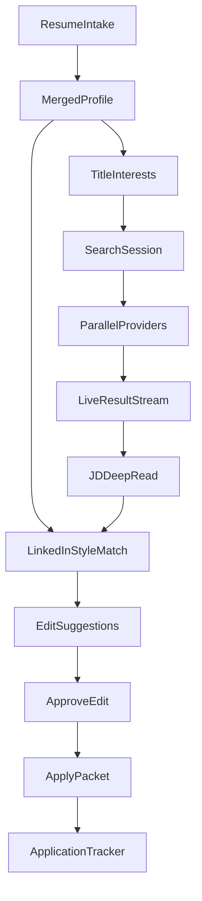
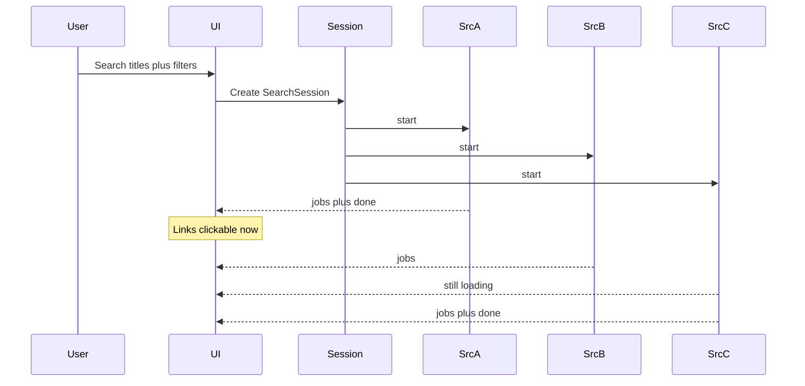
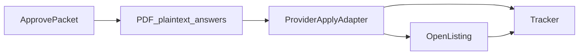

# Job Hunt OS — Product Plan

A daily job-hunt tool: ingest a rich background from one or more resumes, suggest roles and titles, stream listings **source by source** (clickable as they land), fully read each JD for hidden requirements, match like LinkedIn, suggest resume edits, then apply after you approve the packet.

This repo is greenfield. This file is the implementation contract.

## Product defaults

| Decision | Choice |
|---|---|
| Audience | Personal web app first; schema ready for more users later |
| Stack | Next.js (App Router) + TypeScript + SQLite/Prisma (Postgres later) |
| Search | Parallel providers; results stream in per source |
| Matching | Deterministic profile + JD graph, same shape as LinkedIn “Jobs you might be a fit for” |
| Tailoring | Suggested edits from the merged inventory; you accept, reject, or rewrite |
| Apply | Approve-then-send: official listing URL always; ATS / partner apply where the adapter can submit |

Years/seniority caps, source toggles, and template style are **user preferences**, not product locks. Filters default on and can be turned off per search.

## Product loop



Daily use:

1. First run: upload one or more resumes (and optional LinkedIn export / plain text). The app builds a merged background and **suggests job titles**.
2. You add/remove titles, locations, and which sources to hit.
3. Search starts immediately. Jobs appear **per source** with a live spinner; each row is a clickable listing as soon as that source returns.
4. Open a job: full JD, hidden-requirement callouts, LinkedIn-style fit breakdown, suggested resume edits.
5. Accept/reject/edit suggestions, export, approve, apply, log it.

## Resume intake (rich background)

Intake is the foundation. More resumes = a fuller graph of what you have actually done, which makes title suggestions and JD matching deterministic instead of guessy.

### Inputs

- Multiple files: PDF, DOCX, TXT
- Optional paste (LinkedIn About + Experience, or a JD you already tailored toward)
- Later: CSV / JSON export if you keep a master inventory

Each upload is stored as a **ResumeDocument** (raw text + parse tree). Nothing is discarded; a skill that only appears on an older consulting CV still counts for matching.

### What we extract

Parser (layout-aware text extract → section split → structured LLM pass with a strict schema):

| Field | Examples |
|---|---|
| Identity | name, emails, phones, links, locations, work-auth hints |
| Titles held | exact headings + normalized title (`Staff PM` → `product manager`, seniority `staff`) |
| Employment | company, team, dates, employment type, industry, domain |
| Fact bullets | action, object, tools, metrics, outcomes — kept as atomic facts |
| Skills | explicit lists + tools mentioned only in bullets |
| Education / certs | school, degree, license, cert, date |
| Projects / pubs | names, stack, links |
| Preferences inferred | remote vs onsite, industries repeated, leadership vs IC |

### Merge

`MergedProfile` is a union with provenance:

- Same company+title+overlapping dates → one `ExperienceItem`, bullets de-duped
- Conflicting dates or titles → both kept, flagged for you to resolve
- Skills get aliases (`k8s` → `Kubernetes`) and a **confidence** (listed vs only-in-bullet vs only-on-one-resume)
- A fact is never dropped because a newer resume omitted it

### Deterministic role suggestions

From the merged graph, before any LLM “career coach” copy:

1. **Exact titles** you have held
2. **Title taxonomy walk** — adjacent roles (ONET / SOC / a maintained title graph). Example: technical writer → documentation engineer, content designer, developer advocate
3. **Skill-signature titles** — titles whose typical skill vector overlaps yours above a threshold (the LinkedIn “jobs matching your profile” idea)
4. **Industry + function** — e.g. fintech + operations → payments operations, implementation manager
5. **Seniority band** from dates + title words, so we do not only suggest Staff when your history is mid-level

The UI shows each suggestion with **why** (“held adjacent title”, “12 shared skills with typical PM JDs”, “domain: healthcare”). You pin titles into **TitleInterests**. Those, plus any titles you type yourself, drive search.

### User-entered titles

Free-type, multi-value, with autocomplete from the taxonomy. Titles are first-class search queries, not hidden inside a single “lens” box. Lenses become optional groupings (e.g. “writing track” vs “ops track”) over the same title list.

## Job sources (wide catalog)

Every source is a `JobProvider`: `startSearch(query) → AsyncIterable<NormalizedJob | SourceEvent>`.

Providers run **in parallel**. A source that is slow or down does not block others. New providers are additive.

### Aggregators and boards (listings + original URLs)

| Provider | What it covers |
|---|---|
| **JSearch / Google-for-Jobs style APIs** | Indeed, LinkedIn, Glassdoor, ZipRecruiter, and other hosts as they appear in Google Jobs |
| **SerpApi Google Jobs** | Same surface; useful second crawler if JSearch misses a query |
| **JobsPipe / Hirebase / Jobo** (whichever keys we have) | Normalized ATS + board feed, webhooks for new posts |
| **Adzuna** | Country-wide board search |
| **Jooble** | International aggregator |
| **The Muse** | Company-profile-rich posts |
| **USAJobs + CareerOneStop** | US federal / public sector |
| **Remote-first boards** | Remote OK, We Work Remotely, Remotive, Himalayas, Jobicy, Working Nomads |
| **Startup / tech boards** | Wellfound, Otta / Welcome to the Jungle, YC Work at a Startup, HN Who’s Hiring parse when a public feed exists |
| **Specialty** | Dice, Built In, HealthcareJobs, Idealist, Chronicle Vitae — enable per user |
| **RSS / ATOM** | Any board or company feed the user pastes |
| **URL / paste** | Single JD import |

### Company ATS boards (full descriptions, stable apply URLs)

Greenhouse, Lever, Ashby, Workday, SmartRecruiters, Workable, Recruitee, Personio, BambooHR, Teamtailor, Rippling, Jobvite, Comeet, Pinpoint, Polymer — public job-board JSON/XML where it exists.

Seed a large **company slug directory**; users add slugs. These often have the **complete JD** that Google-for-Jobs truncates — required for hidden-requirement reading.

### Source settings

Per search (and saved defaults): enable/disable each provider, country, recency, remote, salary floor. No source is banned at the product layer. If a provider needs an API key, it shows “Connect” and stays in the still-loading dropdown as `needs_key` until configured.

### Dedup

As results stream in: `(normalized company + title + location)` and apply-URL fingerprint. Duplicates merge onto one card with **multiple source links** (Indeed listing + Greenhouse board + LinkedIn post). The first clickable link is shown immediately; extra sources attach when they arrive.

## Progressive search UX

This is the hunt screen.



### Layout

- **Results list** fills from the first payload. Each row: title (link to original listing), company, location, source badge, fit score if enrichment has finished, “still reading JD…” if not.
- **Source bar**
  - Completed: `Adzuna 24` `Greenhouse 18` — click filters the list to that source
  - In flight: spinner + **dropdown** “Still pulling (3): Indeed, LinkedIn, Glassdoor”
  - Failed: `Dice failed — retry`
  - Waiting on keys: `JobsPipe — add API key`
- Clicking a completed source chip does not wait for the others.
- A job is **clickable the moment we have a URL**, even if the deep JD read is still running. Enrichment patches the row in place (hidden-req badges, fit %).

### Transport

`SearchSession` + `SearchSourceRun` rows. The UI subscribes via **SSE** (`/api/search/[id]/events`): `source_started`, `job`, `source_done`, `source_error`, `enrichment`, `session_done`. Polling fallback for environments that buffer SSE.

Each `job` event includes `listingUrl` so the client can render an `<a>` immediately.

## Deep JD read (hidden requirements)

When a listing arrives, a worker fetches the **full description** (aggregator snippet is not enough; prefer ATS `content` / hosted page text via the provider’s documented API or the listing’s public HTML when the provider returns it).

`JDDeepRead` produces:

| Bucket | What we look for |
|---|---|
| **Stated** | Years, degree, skills, location, employment type, salary |
| **Hidden / implied** | Years only in a responsibility line; “fast-paced ownership” = low support; “mentor the team” = lead; “US persons” / clearance; “remote” that is metro-only; travel %; on-call; lifting/physical; language; unpaid overtime culture tells; visa silence + “must be local” |
| **Nice-to-have vs real gate** | Phrases in Requirements vs Responsibilities vs “plus” |
| **Level signals** | Scope (org vs ticket), IC vs manager, Staff language without the title |
| **Domain** | Industry, customer type, regulated environment |
| **Stack** | Tools mentioned once in a duty — still a match signal |

Years/seniority is one slice of this, not the whole filter. User prefs: hide if min years > N, or only **badge** it. Override per job.

## LinkedIn-style matching

LinkedIn ranks jobs from a member graph: titles, skills, seniority, recency, location, and implicit “people like you.” We do the same against `MergedProfile` + `JDDeepRead`.

`matchScore(profile, job)` returns a breakdown, not a single mystery number:

- **Title affinity** — interest titles + held titles vs posting title (taxonomy + string + embedding)
- **Skill overlap** — required / implied / nice-to-have vs possessed (with aliasing)
- **Hidden-req fit** — visa, clearance, degree, onsite, travel, years: pass / soft-miss / hard-miss
- **Seniority alignment** — your band vs posting band
- **Domain / industry**
- **Recency** — relevant facts in the last N years weighted higher
- **Geo / remote**
- **Resume coverage** — could we surface enough inventory to make a credible tailored resume?

Sort inbox by this score. Explain each job in one line: “Strong skill match; hidden 7+ years (you have 4); remote US-only.”

Suggested **additional titles** after a few searches: postings you consistently score well on but did not list.

## Suggested edits (Enhancv+ )

Not only a full rewrite. For each job, a ranked list of **edit suggestions** grounded in the merged inventory and the deep JD read:

- Promote a skill you have that the JD treats as required but is buried
- Add a bullet fact from Resume B that Resume A dropped
- Rephrase a bullet to the JD’s language **without new facts**
- Change the heading title to the interest title that best matches this posting
- Reorder sections / last-role bullets toward implied requirements
- Warn when a hidden requirement is a hard miss (do not “fix” by inventing years)

Each suggestion: rationale, before/after, Accept / Reject / Edit. Accepting writes a `ResumeVersion` for that job. Optional “Apply all safe suggestions” = only promotions/reorders, no wording changes.

ATS score updates live (keywords, placement, format, quantified bullets). Templates: ATS-safe single column default; user can pick another layout.

## Apply



- Every job always has the **live listing link** (from the streaming search).
- After approval, the apply adapter for that host runs if we have one (Greenhouse job-board POST, other ATS apply endpoints, partner apply APIs). Otherwise the listing opens with the packet downloaded.
- Custom screening questions: show them on the job page when the provider exposes them; you answer before Approve.
- Tracker: queued → opened → submitted → interview → closed.

## Architecture

```
app/
  onboarding/        multi-resume intake + title suggestions
  search/            live source-by-source results
  jobs/[id]/         JD deep read, match, suggestions, apply
  profile/           merged inventory, titles, source keys
  applications/      tracker
lib/
  intake/            parse, merge, title suggest
  providers/         one module per source + registry
  search/            session, SSE events, dedup
  jd/                deep read, hidden requirements
  match/             LinkedIn-style scorer
  ats/               gap, score, format
  suggest/           ranked edit suggestions
  resume/            versions, PDF
  apply/             adapters
prisma/schema.prisma
```

### Data model

- **ResumeDocument** — upload, raw text, parse JSON, weight
- **MergedProfile** — identity + derived seniority/geo
- **ExperienceItem / Skill / Education / Project** — facts with `sourceDocumentIds`
- **TitleInterest** — user-pinned or typed titles, optional lens group
- **TitleSuggestion** — generated, with reasons, accepted or dismissed
- **ProviderAccount** — API keys / OAuth per source
- **SearchSession / SearchSourceRun** — status, counts, errors, timings
- **Job** — normalized; `listingUrls[]` by source
- **JDDeepRead** — stated + hidden requirements, stack, level, domain
- **Match** — score vector + explanation
- **EditSuggestion / TailoringSession / ResumeVersion**
- **Application**

## Implementation phases

### Phase 0 — Intake + paste JD

- Upload one or more resumes, merge profile, suggest titles, accept typed titles
- Paste a JD → deep read + match breakdown + edit suggestions
- No live providers yet; proves the LinkedIn-style loop

### Phase 1 — Streaming search

- Provider registry and SSE session
- Source bar + still-pulling dropdown + clickable rows as they arrive
- Ship with every provider we can key: Adzuna, USAJobs, JSearch (LinkedIn/Indeed/Glassdoor/ZipRecruiter), Greenhouse/Lever/Ashby watchlist, Remote OK / Remotive, RSS
- Dedup and attach extra source links on the fly

### Phase 2 — Full catalog + matching polish

- Remaining ATS boards + specialty boards
- Hidden-req badges on the inbox
- Title suggestions that learn from high-fit jobs
- Years filter as a preference

### Phase 3 — Tailor + apply + tracker

- Suggestion accept/reject/edit, PDF, approve-then-send
- ATS apply adapters where endpoints exist
- Daily refresh of saved title interests

## Env / keys (as sources are enabled)

- `ADZUNA_APP_ID`, `ADZUNA_APP_KEY`
- `USAJOBS_API_KEY`
- `JSEARCH_API_KEY` / `RAPIDAPI_KEY`
- `SERPAPI_KEY`
- `JOBSPIPE_API_KEY` (or Hirebase / Jobo)
- `JOOBLE_API_KEY`
- `OPENAI_API_KEY` or `LLM_BASE_URL` + `LLM_API_KEY`

Keys are per-source and optional. The still-pulling dropdown is how a missing key is surfaced.

## Risks

- **Snippet vs full JD:** aggregators often truncate. Prefer ATS/full-page text before hidden-req scoring; show “partial JD” when we only have a snippet.
- **Rate limits:** cache by provider job id; stagger source starts slightly if a key is shared; never block the UI on a slow source.
- **Parse conflicts:** multi-resume merge will disagree; surface conflicts instead of silently picking one.
- **Match theater:** every score needs a why-line. If we cannot explain it, it is not a match feature.
- **Apply forms:** custom questions break POSTs; listing link is always the fallback.
- **Provider ToS / keys:** each adapter stays behind that vendor’s documented API or licensed feed. The product does not special-case a source as forbidden.

## Success for v1

You upload two resumes, get a suggested title list you can edit, hit search, and watch Indeed / LinkedIn / Greenhouse / Adzuna fill in independently. You click a listing the second it appears. Opening it shows hidden requirements and a LinkedIn-style fit explanation, plus concrete edit suggestions drawn from both resumes. You approve a version and apply without waiting for every source to finish.
