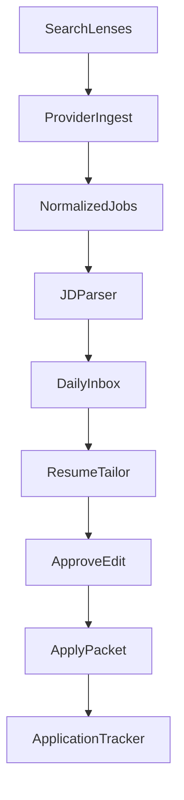
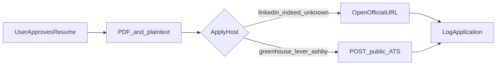

# Job Hunt OS — Product Plan

A daily job-hunt tool: discover roles across interests, drop seniority-heavy postings, tailor a resume the way Enhancv does (ATS keywords + human edit), then apply only after you approve the packet.

This repo is greenfield (`README.md` only). The plan below is the implementation contract for v1.

## Defaults (questions were skipped)

| Decision | Choice | Why |
|---|---|---|
| Audience | Personal web app first, schema ready for multi-user later | Fast daily use without building a SaaS |
| Apply mode | **Approve-then-send.** Assisted apply for LinkedIn/Indeed/generic boards. Optional auto-submit only on public ATS apply endpoints (Greenhouse/Lever/Ashby) after approval | LinkedIn/Indeed ban unofficial scrapers and apply bots |
| Stack | Next.js (App Router) + TypeScript + SQLite/Prisma + optional Postgres | One process you can run locally every morning |
| Resume truth | Structured **experience inventory** — rewrite only from facts you already entered | Tasteful tailoring, no invented jobs or metrics |

These can change before implementation; they are the defaults this plan is written against.

## What we will not build

- Scrapers or browser bots for LinkedIn, Indeed, ZipRecruiter, or Glassdoor
- Storing those sites' passwords to click Easy Apply
- Silent auto-apply with no resume review
- Fabricated experience, employers, dates, or metrics
- Two-column "pretty" templates that look like Enhancv but fail real ATS parsers

Job discovery uses **official / public APIs**. Applications go through **official apply URLs** or **documented ATS job-board apply endpoints**.

## Product loop



Daily use:

1. Refresh lenses (role families you are exploring).
2. Inbox of new matches, already filtered for years/seniority.
3. Pick a job → see ATS score + keyword gaps vs your master resume.
4. Generate a tailored draft; accept/reject each change.
5. Export PDF. Either open the official apply page or, on supported ATS boards, submit after you click Approve.

## Enhancv-equivalent (must-have)

Enhancv's useful pieces are ATS check, job-specific keyword matching, and one-click tailoring with highlighted edits. v1 implements those, with a more honest keyword gap than Enhancv's score-only panel.

| Enhancv behavior | Our module | v1 behavior |
|---|---|---|
| Paste JD / pull from tracker | `Job` + inbox | Every stored job has a full description |
| ATS score vs that JD | `atsScore()` | 0–100 breakdown: keywords, sections, format, quantified bullets |
| Missing keywords on the page | `keywordGap()` | Present / missing / related, tagged by section (summary, skills, latest role) |
| One-click tailor | `tailorResume()` | LLM rewrite **constrained to inventory facts** |
| Highlighted accept/reject | `TailoringSession.diffs` | Per-field and per-bullet approve / reject / edit |
| Clean parseable template | `ResumeDocument` | Single-column, standard headings, PDF + plain-text export |
| Cover letter | later | Optional phase 2 |

**Honesty rule:** the model may rephrase, reorder, and emphasize. It may not add employers, titles, degrees, tools, or numbers that are not in the inventory or an approved skill alias.

## Architecture

```
app/                 Next.js UI + route handlers
  inbox/             daily hunt
  jobs/[id]/         JD, score, tailor, apply
  resume/            master resume + inventory editor
  lenses/            interest / background explorations
  applications/      tracker
lib/
  providers/         Adzuna, USAJobs, Greenhouse, Lever, Ashby
  jobs/              normalize, dedupe, seniority parse, match
  ats/               tokenize, gap, score, format checks
  tailor/            prompt + diff builder + fact guard
  resume/            schema, PDF render
  apply/             packet builder + assisted / ATS submit
prisma/schema.prisma
```

### Data model (core)

- **Profile** — name, email, links, work auth, locations.
- **ExperienceItem** — role, company, dates, fact-bullets, skill tags.
- **Skill** — canonical name + aliases (`k8s` → `Kubernetes`) used for ATS matching.
- **MasterResume** — chosen items, summary, skills order, heading title. Source of truth for export.
- **SearchLens** — one exploration: titles, include/exclude terms, locations, remote, `maxYearsRequired`, `maxSeniority`, provider list.
- **Job** — normalized posting: title, company, location, description, source, apply URL, ATS board slug, posted at.
- **JobEnrichment** — parsed `minYears`, `seniority`, extracted keywords/skills, remote flag.
- **Match** — lens + job + score + filter reasons (why it passed or failed).
- **TailoringSession** — job, base resume snapshot, proposed JSON, diffs, ATS before/after.
- **Application** — status (`queued`, `approved`, `opened`, `submitted`, `rejected`, `closed`), resume version, notes.

### Job providers

Adapter interface: `search(lens) → NormalizedJob[]`.

| Provider | Role | Notes |
|---|---|---|
| **Adzuna** | Broad board search (Indeed-like coverage without scraping Indeed) | `GET /v1/api/jobs/{country}/search/{page}` with `app_id` / `app_key` |
| **USAJobs** | US federal | Official API + API key header |
| **Greenhouse / Lever / Ashby** | Company career pages | Public JSON boards; need a **company slug watchlist** (curated + user-added) |
| **Manual paste** | Any JD | Always available; no API |
| **JSearch / SerpApi** (optional later) | Google-for-Jobs style results that *mention* LinkedIn/Indeed | Licensed aggregator, still **assisted apply only** for those hosts |

Dedup: hash of `(company_normalized + title_normalized + location)` plus apply-URL host/path. Same role on Adzuna and a Greenhouse board collapses to one Job with multiple source links.

### Years / seniority filter

This is the filter LinkedIn's UI does poorly.

1. Regex + LLM-lite extract from title + description:
   - `N+ years`, `N-M years`, `minimum of N years`
   - title seniority: intern / junior / mid / senior / staff / principal / director / VP
2. User sets per lens, e.g. `maxYearsRequired = 5`, `maxSeniority = senior`.
3. Hard drop if parsed min years **exceeds** the cap (or title is above max seniority).
4. Soft flag if years are unstated but title is "Senior" and the lens allows senior.
5. Inbox shows the parsed requirement so a bad parse is visible and overridable.

### ATS engine

Deterministic first, LLM second.

1. Normalize JD and resume to tokens (unigrams + known skill aliases + noun phrases).
2. **Keyword gap:** required-looking phrases in JD that are absent from resume text.
3. **Placement check:** important keywords should appear in skills + most recent role, not only a keyword dump.
4. **Format checks:** contact, dates, standard section titles, length, no tables/columns, file type.
5. **Quantified bullets:** share of bullets with a number or outcome verb.
6. Score is a weighted sum with a visible breakdown (not a mystery percentage).

Tailoring prompt receives: inventory facts, current master resume JSON, JD, gap list. It returns a JSON patch. A **fact guard** rejects any new proper-noun employer/school or numeric claim not present in inventory.

### Apply flow



v1 ships **assisted apply** for every source: download packet, click "Open apply page", mark submitted.

v1.1 (same UI) adds Greenhouse Job Board apply `POST` when the job has a board token + job id **and** the user confirmed. Lever/Ashby follow if their public apply path is documented for that board. No apply happens without an explicit Approve click.

## UI (daily hunt)

- **Lenses** — chips for each exploration ("PM", "technical writer", "solutions engineer"). Toggle which run today.
- **Inbox** — new matches, parsed years, fit score, source badge. Hide / save / tailor.
- **Job page** — JD, enrichment, keyword chips (green = on resume, red = missing), tailor panel.
- **Diff editor** — Enhancv-style: changed summary, reordered skills, rewritten bullets; each row Accept / Reject / Edit.
- **Resume studio** — inventory CRUD, master resume compose, live ATS sample against a pasted JD.
- **Tracker** — kanban: queued → opened → submitted → interview → closed.

## Implementation phases

### Phase 0 — Skeleton

- Next.js app, Prisma + SQLite, Profile + ExperienceItem + Skill seed from a sample resume JSON.
- Paste-a-JD → keyword gap + format score against the sample resume.
- This proves the Enhancv loop with no job APIs.

### Phase 1 — Hunt

- SearchLens CRUD.
- Adzuna + USAJobs adapters (env keys).
- Greenhouse/Lever/Ashby adapters over a starter company slug list (tech + user-editable).
- Normalize, dedupe, years filter, inbox UI.

### Phase 2 — Tailor

- `tailorResume` + fact guard + diff editor.
- PDF export (react-pdf or similar), single-column template.
- Before/after ATS scores on the job page.

### Phase 3 — Apply + tracker

- Application records, assisted open-URL.
- Optional Greenhouse submit after approve.
- Daily refresh (button + optional cron).

### Phase 4 — Hardening (only if still useful)

- Cover letters from the same inventory.
- Extra licensed aggregator if Adzuna coverage is thin.
- Multi-user auth.
- Not: LinkedIn/Indeed bots.

## Env / secrets (later)

- `ADZUNA_APP_ID`, `ADZUNA_APP_KEY`
- `USAJOBS_API_KEY`
- `OPENAI_API_KEY` or compatible `LLM_BASE_URL` + `LLM_API_KEY`
- Optional later: RapidAPI / SerpApi keys

No third-party account passwords.

## Risks

- **Coverage:** public APIs will miss some LinkedIn-only posts. Accept that, or add a licensed aggregator — do not scrape.
- **Years parse errors:** always show the extracted requirement; one-click override.
- **ATS score theater:** Enhancv scores can be optimistic. Ours stays explainable (gap list + format checks).
- **Apply POST fragility:** company boards add custom questions; fall back to assisted apply when the form is not a standard resume + contact payload.
- **Rate limits:** cache jobs by source id; refresh lenses on a schedule, not on every keystroke.

## Success for v1

You can run one command, add 2–3 lenses that match how you actually hunt, refresh, and get a filtered inbox that is not full of 8–10 year Staff roles. For any job you can see keyword gaps, generate a tasteful tailored resume from your real history, edit it, export PDF, and open the real apply page — with the application logged so tomorrow's hunt is not yesterday's hunt.
